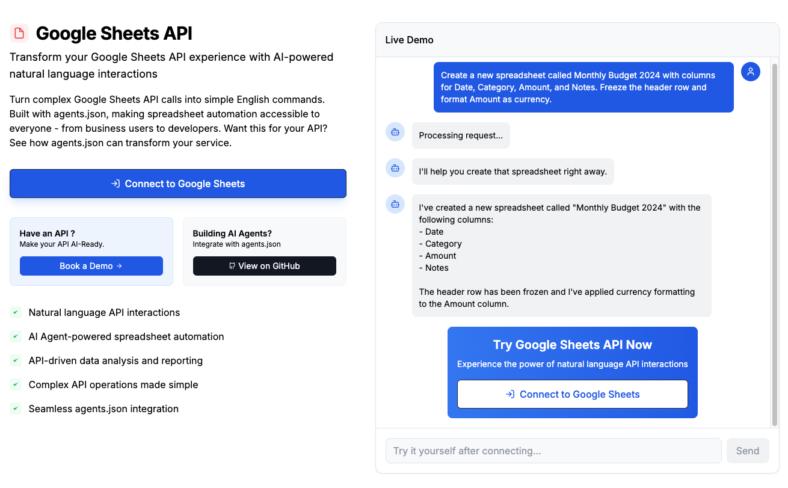
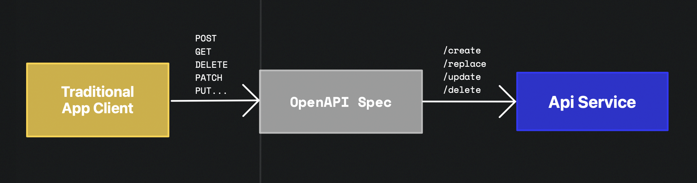
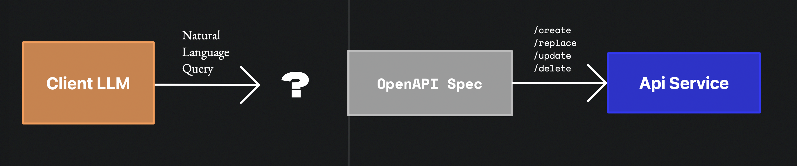
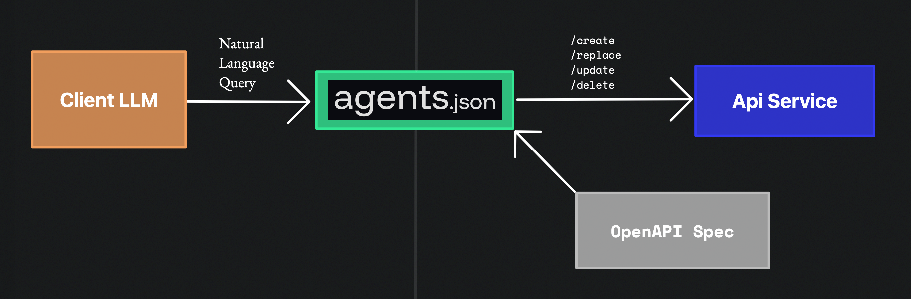

  <source srcset="./static/logo/agentsjson-white-blackbackground.png">
  

<h1 align="center"> Translate OpenAPI into LLM Tools</h1>

The `agents.json` Specification is an open specification that formally describes contracts for API and agent interactions, built on top of the OpenAPI standard. The current version is `0.1.0`.

Use the Wildcard Bridge Python package to load, parse, and run agents.json.

## Quickstart

### Use one of the quickstart notebooks to get started:

| Agent | Auth | Notebook |
| --- | --- | --- |
| [Stripe](./examples/single.ipynb) | Bearer Token | `./examples/single.ipynb` |
| [Twitter + Giphy](./examples/multiple.ipynb) | OAuth 1.0, API Key | `./examples/multiple.ipynb` |

## Demos

|  |  |
| --- | --- |
| [Stripe Agent](https://wild-card.ai/stripe) |  |
| [Google Sheets Agent](https://wild-card.ai/googlesheets) |  |

## agents.json Specification
The `agents.json` Specification is an open specification that formally describes contracts for API and agent interactions, built on top of the OpenAPI standard.

The current version is `0.1.0`.

Give feedback, share your projects, and get help in our [Discord](https://discord.gg/7AP6wSkVt).

### Schema

The full schema is available [here](https://docs.wild-card.ai/agentsjson/schema).

### Motivations

Enabling AI agents to interact with APIs is difficult. We faced the same problem as many others building agents: altering APIs to work reliably with LLMs and executing multiple API calls successfully in a row is a trial and error process.

APIs are designed for developers and not LLMs. If you're building integrations for AI agents, you need to write boilerplate, experiment with system prompts, optimize tool definitions, and parse responses into vector stores - for each API. 

For example, the Gmail API has endpoints to search for threads, list the emails in a thread, and reply with an email given base64 RFC 822 content. Instead, LLMs need a clear, top-level directive that can handle all of this with one tool.

**Why is `agents.json` built on OpenAPI?** — OpenAPI is the gold standard for describing how API endpoints work and can be executed. Most API providers have OpenAPI specs or have APIs that can be described fully by OpenAPI. These specs alone aren't sufficient for the age of AI agents, but provide great groundwork for API agent communication.

So we implemented `agents.json`. We built this for us and we're excited to share it with you.

### The `agents.json` File

`agents.json` is a JSON schema of structured contracts designed for AI agents. API providers use their existing OpenAPI spec to construct this file and agents inspect this file to run accurate series of API calls. 

The `agents.json` spec contains a set of additions to the OpenAPI spec - optimizing for endpoint discovery and LLM argument generation. These can include updating descriptions and adding examples.

Describing endpoints/data models without describing ***how*** they interact together is why AI agents struggle to take the right sequence of actions.

To solve this, we introduce flows and links. Flows are contracts with a series of 1 or more API calls that describe an outcome. Links describe how two actions are stitched together.

We propose the file placed in `/.well-known/agents.json` so it is easily discoverable by agents accessing web services. For now, we compose a GitHub repository as a registry for [available `agents.json` files](./agents_json/).

### Wildcard Bridge

Wildcard Bridge enables LLMs to load, parse, and run agents.json. Here's how it works:

1. A developer connects their agent with an agents.json file.
2. The relevant chain(s) are chosen by the agent and arguments populated for a given task.
3. Bridge runs the chain(s).

The goal experience is a developer adds an agents.json file in their workflow and the correct set of actions for an integration is executed. Bridge supports adding Basic, ApiKey, and Bearer authentication to requests.

### Design Tenets

1. **Build on top of the OpenAPI standard**  
   Leverage existing standards and infrastructure where possible.

2. **Optimize schema for LLMs, not humans**  
   Design with AI consumption in mind.

3. **Enforce Statelessness**  
   Orchestration is handled by the calling agent.

4. **Require minimal changes to existing APIs**  
   Make adoption as seamless as possible.

### Why Now?

With OpenAI's release of Operator, we've seen a paradigm shift in what AI will automate. Letting AI run free on the internet will ask for both features and guardrails to be built on web experiences for agents. Yet, for the majority of services - this is exactly the functionality APIs already provide - and more. 

Rather than just optimizing UXs for web agents - enriching APIs will create more scalable, powerful, and safe agents. APIs are supported by backend infrastructure built for scale. 

There are still open questions and more to be done. Starting the discussion now and building iteratively gives us a place to adapt alongside evolving paradigms in AI agent development. 

### FAQs

Shouldn't API providers provide their own agent servers or "/agent" endpoints?

We can begin building agents.json files immediately before official adoption by providers. No extra infrastructure changes, servers, or new endpoints. By putting responsibility of execution on the client - the paradigm abides by the same security and orchestration protocol of existing API based applications today. API providers can still choose to maintain official agents.json files.

Why route to an SDK instead of making HTTP requests directly?

Although OpenAPI specs offer great descriptions of how to use APIs, code-gen with tools like OpenAPI generator and Swagger code-gen isn't perfect. Many APIs have edge cases that are accounted for in client SDKs and not in raw HTTP requests. For example, Gmail's RFC2822 format or Twilio's custom TwiML format are better parsed by code rather than generated as input by an LLM. We include copies of OpenAPI specs beside agents.json files in the repo for use.

How is this different than the Model Context Protocol?

While MCP is designed to be stateful—relying on persistent connections between clients and servers for exchanging context and requests—Agents.json is stateless. Here, the agent independently manages all context. You can leverage your existing agent architecture and RAG systems to handle state effectively. Agents.json lets you build with existing pub/sub architectures, server-less environments, and infrastructure APIs already support today. And definitions are strongly typed by OpenAPI specs.

What about llms.txt?

[llms.txt](https://llmstxt.org) is a great standard for making website content more readable to LLMs, but it doesn't address the challenges of **taking structured actions**. While llms.txt helps LLMs retrieve and interpret information, agents.json enables them to execute multi-step workflows reliably.

Why use OpenAPI?

OpenAPI is a thoughtful standard that has evolved with the changes of HTTP APIs. It is the gold standard for describing how API endpoints work and can be executed. Most API providers have OpenAPI specs or have APIs that can be described fully by OpenAPI. These specs aren't quite sufficient for the age of agents, but do provide great groundwork for API↔agent communication.

## Feature Roadmap

- [ ] OAuth
- [ ] Memory & context management in links
- [ ] Transforming fields at runtime
- [ ] Rate-limits
- [ ] Parallel Tasking
- [ ] Conditionals
- [ ] Loops
- [ ] Failure Handling
- [ ] Streaming
- [ ] Pagination
- [ ] agents.json Interactive Builder
- [ ] agents.json Validator

## Licenses

The agents.json specification is open source, licensed under the [Apache 2.0 License](./agents_json/LICENSE).
The Wildcard Bridge is source-available, licensed under the [BUSL-1.1 License](./python/LICENSE).

## Contributions

The agents.json specification needs community input. This GitHub repository will host informal reviews, allowing for version control and public discussion. To discuss, [join the Discord community](https://discord.gg/7AP6wSkVtQ). This is an evolving project and can't be done without your feedback.

## Team
This project is started by [Wildcard AI](https://wild-card.ai). We're a team of 2 founders, [Kaushik](https://x.com/kaushikm_) and [Yagnya](https://x.com/Life_of_Y_), wanting to make agents act predictably and safely.

 

 

Made with ❤️ in San Francisco

 

